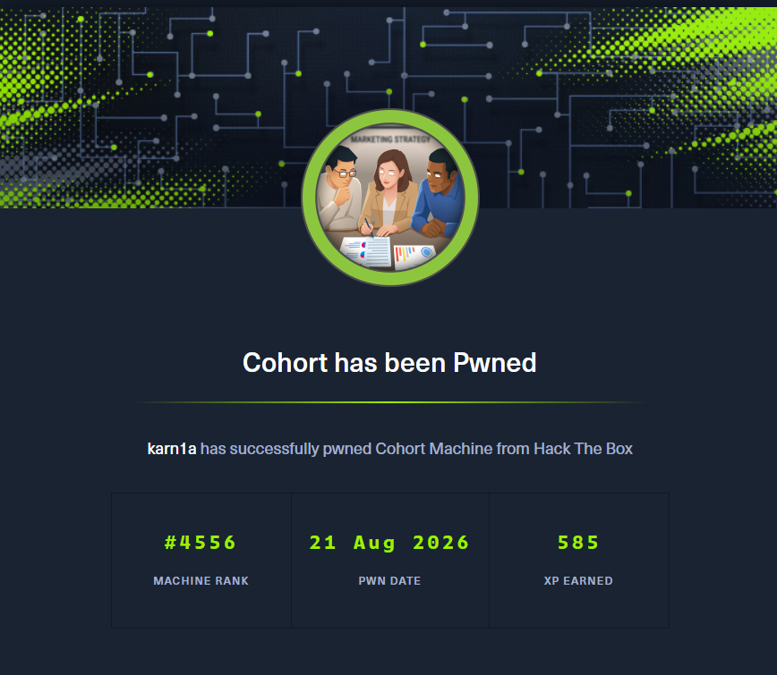

## Nmap Enumeration

```bash
$ nmap -p 22,80,443 -sVC -Pn 10.129.25.80 --min-rate=2000 -oN cohort_nmap
Starting Nmap 7.95 ( https://nmap.org ) at 2026-08-16 14:17 IST
Stats: 0:00:07 elapsed; 0 hosts completed (1 up), 1 undergoing Service Scan
Service scan Timing: About 33.33% done; ETC: 14:17 (0:00:14 remaining)
Nmap scan report for 10.129.25.80
Host is up (0.27s latency).

PORT    STATE SERVICE  VERSION
22/tcp  open  ssh      OpenSSH 9.6p1 Ubuntu 3ubuntu13.18 (Ubuntu Linux; protocol 2.0)
| ssh-hostkey: 
|   256 0c:4b:d2:76:ab:10:06:92:05:dc:f7:55:94:7f:18:df (ECDSA)
|_  256 2d:6d:4a:4c:ee:2e:11:b6:c8:90:e6:83:e9:df:38:b0 (ED25519)
80/tcp  open  http     nginx 1.24.0 (Ubuntu)
|_http-title: Did not follow redirect to https://cohort.htb/
|_http-server-header: nginx/1.24.0 (Ubuntu)
443/tcp open  ssl/http nginx 1.24.0 (Ubuntu)
| ssl-cert: Subject: commonName=cohort.htb/organizationName=Cohort Analytics
| Subject Alternative Name: DNS:cohort.htb, DNS:*.cohort.htb
| Not valid before: 2026-06-01T18:47:07
|_Not valid after:  2126-05-08T18:47:07
|_http-server-header: nginx/1.24.0 (Ubuntu)
|_http-title: Did not follow redirect to https://cohort.htb/
| tls-alpn: 
|   http/1.1
|   http/1.0
|_  http/0.9
|_ssl-date: TLS randomness does not represent time
Service Info: OS: Linux; CPE: cpe:/o:linux:linux_kernel

Service detection performed. Please report any incorrect results at https://nmap.org/submit/ .
Nmap done: 1 IP address (1 host up) scanned in 29.55 seconds

```

The ports 22, 80 and 443 are open. Let’s also add `cohort.htb` to our hosts file.

*This box is still active on HackTheBox. Once retired, this writeup will be published for public access as per HackTheBox's policy on publishing content from their platform*