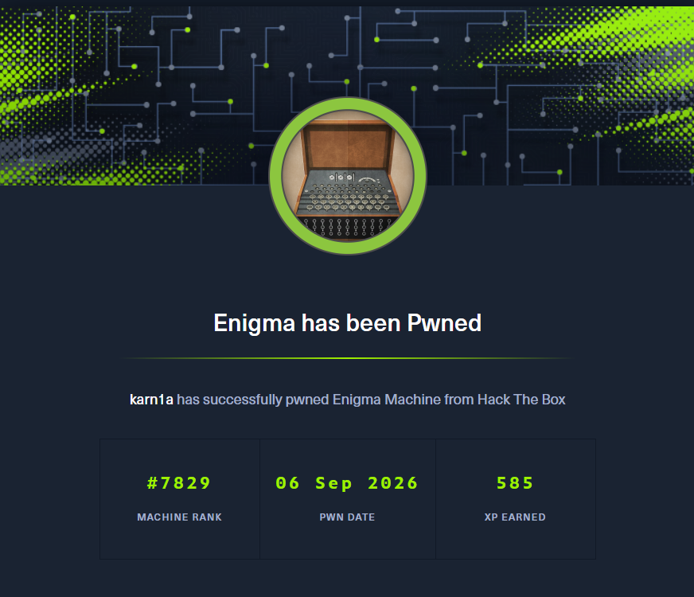

## Enumeration

### Nmap Scan

```bash
Starting Nmap 7.95 ( https://nmap.org ) at 2026-09-02 10:09 IST
Nmap scan report for 10.129.239.191
Host is up (0.071s latency).

PORT      STATE SERVICE  VERSION
22/tcp    open  ssh      OpenSSH 9.6p1 Ubuntu 3ubuntu13.16 (Ubuntu Linux; protocol 2.0)
| ssh-hostkey: 
|   256 0c:4b:d2:76:ab:10:06:92:05:dc:f7:55:94:7f:18:df (ECDSA)
|_  256 2d:6d:4a:4c:ee:2e:11:b6:c8:90:e6:83:e9:df:38:b0 (ED25519)
80/tcp    open  http     nginx 1.24.0 (Ubuntu)
|_http-title: Did not follow redirect to http://enigma.htb/
|_http-server-header: nginx/1.24.0 (Ubuntu)
110/tcp   open  pop3     Dovecot pop3d
|_ssl-date: TLS randomness does not represent time
| ssl-cert: Subject: commonName=enigma
| Subject Alternative Name: DNS:enigma
| Not valid before: 2026-02-18T20:33:33
|_Not valid after:  2036-02-16T20:33:33
|_pop3-capabilities: CAPA SASL TOP RESP-CODES PIPELINING STLS AUTH-RESP-CODE UIDL
111/tcp   open  rpcbind  2-4 (RPC #100000)
| rpcinfo: 
|   program version    port/proto  service
|   100000  2,3,4        111/tcp   rpcbind
|   100000  2,3,4        111/udp   rpcbind
|   100000  3,4          111/tcp6  rpcbind
|   100000  3,4          111/udp6  rpcbind
|   100003  3,4         2049/tcp   nfs
|   100003  3,4         2049/tcp6  nfs
|   100005  1,2,3      33565/udp6  mountd
|   100005  1,2,3      44975/udp   mountd
|   100005  1,2,3      53633/tcp   mountd
|   100005  1,2,3      53927/tcp6  mountd
|   100021  1,3,4      40409/tcp6  nlockmgr
|   100021  1,3,4      40923/udp   nlockmgr
|   100021  1,3,4      41189/tcp   nlockmgr
|   100021  1,3,4      50487/udp6  nlockmgr
|   100024  1          44473/tcp   status
|   100024  1          56301/udp   status
|   100024  1          57379/tcp6  status
|   100024  1          58900/udp6  status
|   100227  3           2049/tcp   nfs_acl
|_  100227  3           2049/tcp6  nfs_acl
143/tcp   open  imap     Dovecot imapd (Ubuntu)
|_imap-capabilities: LOGINDISABLEDA0001 IMAP4rev1 OK ID LOGIN-REFERRALS post-login SASL-IR capabilities listed Pre-login IDLE have ENABLE STARTTLS more LITERAL+
|_ssl-date: TLS randomness does not represent time
| ssl-cert: Subject: commonName=enigma
| Subject Alternative Name: DNS:enigma
| Not valid before: 2026-02-18T20:33:33
|_Not valid after:  2036-02-16T20:33:33
993/tcp   open  ssl/imap Dovecot imapd (Ubuntu)
|_ssl-date: TLS randomness does not represent time
|_imap-capabilities: post-login IDLE ID LOGIN-REFERRALS have SASL-IR capabilities listed Pre-login ENABLE AUTH=PLAINA0001 IMAP4rev1 OK more LITERAL+
| ssl-cert: Subject: commonName=enigma
| Subject Alternative Name: DNS:enigma
| Not valid before: 2026-02-18T20:33:33
|_Not valid after:  2036-02-16T20:33:33
995/tcp   open  ssl/pop3 Dovecot pop3d
|_pop3-capabilities: CAPA USER TOP RESP-CODES PIPELINING SASL(PLAIN) AUTH-RESP-CODE UIDL
| ssl-cert: Subject: commonName=enigma
| Subject Alternative Name: DNS:enigma
| Not valid before: 2026-02-18T20:33:33
|_Not valid after:  2036-02-16T20:33:33
|_ssl-date: TLS randomness does not represent time
2049/tcp  open  nfs_acl  3 (RPC #100227)
41189/tcp open  nlockmgr 1-4 (RPC #100021)
44473/tcp open  status   1 (RPC #100024)
47403/tcp open  mountd   1-3 (RPC #100005)
51443/tcp open  mountd   1-3 (RPC #100005)
53633/tcp open  mountd   1-3 (RPC #100005)
Warning: OSScan results may be unreliable because we could not find at least 1 open and 1 closed port
Device type: general purpose
Running: Linux 4.X|5.X
OS CPE: cpe:/o:linux:linux_kernel:4 cpe:/o:linux:linux_kernel:5
OS details: Linux 4.15 - 5.19
Network Distance: 2 hops
Service Info: OS: Linux; CPE: cpe:/o:linux:linux_kernel

OS and Service detection performed. Please report any incorrect results at https://nmap.org/submit/ .
Nmap done: 1 IP address (1 host up) scanned in 21.20 seconds

```

### NFS ACL

From the Nmap scan output, we can see that NFS (Network File System) is running on the machine, with NFSv3/v4 and `mountd` exposed

`mountd` is a service on Unix and Linux systems that handles file system mount requests from remote machines using the NFS protocol.

*This box is still active on HackTheBox. Once retired, this writeup will be published for public access as per HackTheBox's policy on publishing content from their platform*