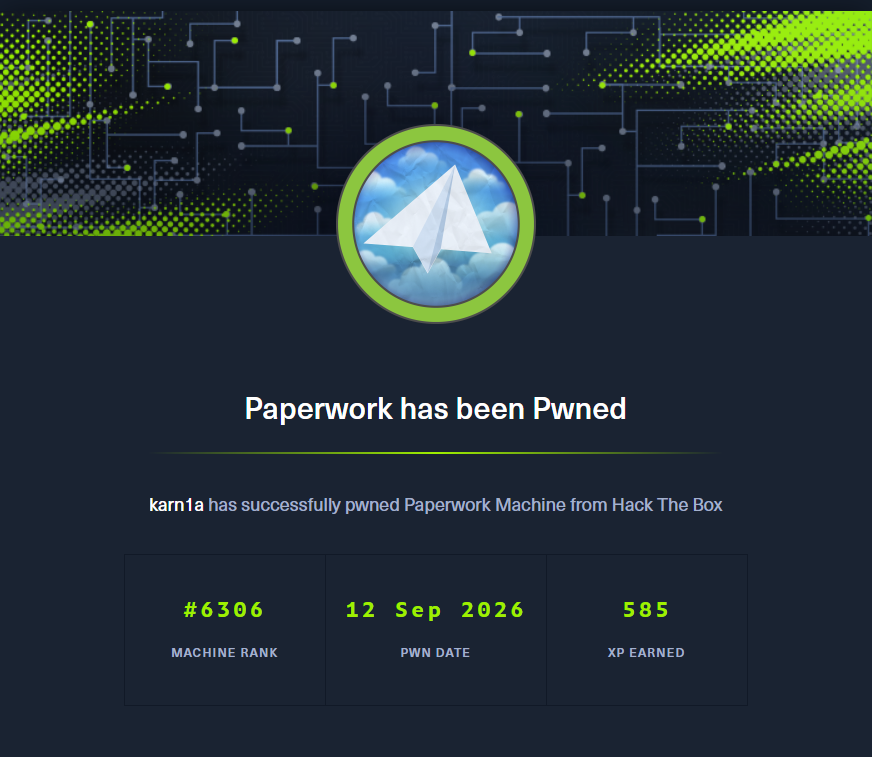

# Enumeration

## Nmap Scan

```bash
Nmap scan report for 10.129.37.3
Host is up (0.073s latency).

PORT     STATE SERVICE        VERSION
22/tcp   open  ssh            OpenSSH 10.0p2 Ubuntu 5ubuntu5.4 (Ubuntu Linux; protocol 2.0)
80/tcp   open  http           nginx 1.28.0 (Ubuntu)
|_http-title: Did not follow redirect to http://paperwork.htb/
|_http-server-header: nginx/1.28.0 (Ubuntu)
1515/tcp open  ifor-protocol?
| fingerprint-strings: 
|   TerminalServer, TerminalServerCookie: 
|_    Archive_Printer is ready and printing.
1 service unrecognized despite returning data. If you know the service/version, please submit the following fingerprint at https://nmap.org/cgi-bin/submit.cgi?new-service :
SF-Port1515-TCP:V=7.95%I=7%D=9/9%Time=6AA12827%P=x86_64-pc-linux-gnu%r(Ter
SF:minalServerCookie,27,"Archive_Printer\x20is\x20ready\x20and\x20printing
SF:\.\n")%r(TerminalServer,27,"Archive_Printer\x20is\x20ready\x20and\x20pr
SF:inting\.\n");
Service Info: OS: Linux; CPE: cpe:/o:linux:linux_kernel

Service detection performed. Please report any incorrect results at https://nmap.org/submit/ .
```

## `paperwork.htb`

Navigating to `http://paperwork.htb`, we are greeted with the following webpage:-

*This box is still active on HackTheBox. Once retired, this writeup will be published for public access as per HackTheBox's policy on publishing content from their platform*